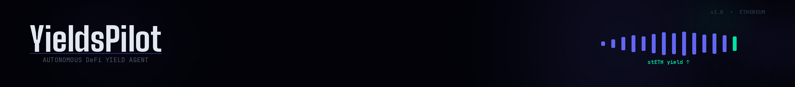

<div align="center">

  

  <h1>YieldsPilot</h1>
  <h3>Autonomous DeFi Agent with Privacy-Preserving Yield Management</h3>

  <p>
    <a href="https://yieldspilot.com"></a>
    
  </p>

</div>

---

> **Private cognition. Trusted onchain action.**

YieldsPilot is an autonomous AI agent that manages staking yield on behalf of users. You deposit stETH (or wstETH), the agent earns yield via Lido's rebasing mechanism, privately reasons about how to manage that yield (swap, rebalance, compound), and every action is executed and verified onchain. **The agent can never touch your principal, only the yield it generates.**

---

## Live

🌐 Live on **[yieldspilot.com](https://yieldspilot.com)**

**Mainnet Registry Contract**: [`0xe916C0519fE874dCa9D4051f16ddCd35a45b7917`](https://etherscan.io/address/0xe916C0519fE874dCa9D4051f16ddCd35a45b7917)

---

## Demo Videos

### Application Demo
> 📹 **[Watch App Demo on YouTube](https://youtu.be/m_G9j7chDsc)**
>
> Full walkthrough: connect wallet → deposit stETH → treasury creation → agent monitoring dashboard → treasury management (withdraw, pause, daily limits, allowed targets) → deposit more stETH and wstETH to existing treasury

### Lido MCP Server Demo
> 📹 **[Watch MCP Demo on YouTube](https://youtu.be/4Mxcwr_oTcI)**
>
> Standalone Lido MCP server in action: Claude Desktop integration → query staking positions → check balances → stake ETH → wrap/unwrap stETH ↔ wstETH → governance delegation, all via natural language

### Uniswap Swap Simulation (Mainnet Fork)
> 📹 **[Watch Uniswap Sim on YouTube](https://youtu.be/2CdfMGWShxc)**
>
> Live recording of the mainnet fork test proving real Uniswap V3 swaps work against production contracts

**Why a fork test instead of a live mainnet swap?** Lido staking rewards accrue slowly. On a fresh deposit, daily yield is fractions of a cent. Waiting days for enough yield to execute a meaningful swap isn't practical for a hackathon demo. Instead, we fork Ethereum mainnet locally using Hardhat, deploy our contracts against real Lido and Uniswap V3 pools, inject simulated yield, and execute a real swap (0.5 stETH → 0.4999 WETH via the wstETH/WETH 0.01% fee pool). This proves the entire swap pipeline works end-to-end against production contracts, using the same bytecode, same liquidity, same AMM math, with zero gas cost and instant results. All 4 fork tests pass: swap execution, daily limit enforcement, non-agent rejection, and disallowed router rejection.

---

## How It Works

```
┌─────────────────────────────────────────────────────────┐
│                    HUMAN (You)                          │
│   Deposit stETH → YieldsPilot Treasury                  │
│   Principal: LOCKED    |  Yield: AGENT-MANAGED          │
└─────────────────────────┬───────────────────────────────┘
                          │ yield accrues daily (rebasing)
                          ▼
┌─────────────────────────────────────────────────────────┐
│              YIELDPILOT AGENT LOOP                      │
│                                                         │
│  1. DISCOVER  │ Check treasury balance, yield, rates    │
│  2. PLAN      │ Venice (private) + Bankr (multi-model)  │
│  3. EXECUTE   │ Swap on Uniswap / Rebalance / Hold     │
│  4. VERIFY    │ Confirm onchain state matches intent    │
│                                                         │
│  Every action logged → agent_log.json (ERC-8004)        │
└─────────────────────────────────────────────────────────┘
```

## Architecture

| Layer | Technology | Purpose |
|-------|-----------|---------|
| **Treasury** | Solidity 0.8.24 + OpenZeppelin | Yield-separated vault (principal locked, yield spendable) |
| **Private Reasoning** | Venice AI (no-data-retention) | Agent thinks privately, acts publicly |
| **Multi-Model Analysis** | Bankr LLM Gateway | Risk (GPT-4o) + Market (Claude) + Strategy (Llama) |
| **Swap Execution** | Uniswap V3 | Real token swaps with real TxIDs |
| **Staking Ops** | Lido SDK + MCP | Stake, unstake, wrap, unwrap, balance queries |
| **Monitoring** | Vault Monitor + Telegram | Real-time alerts on yield changes |
| **Identity** | ERC-8004 | Onchain agent identity with structured logs |
| **Dashboard** | React + Vite + Tailwind | Beautiful real-time agent monitoring UI |

---

## What Makes YieldsPilot Special

### The Problem
DeFi yield management is tedious, time-consuming, and error-prone. Users stake ETH, earn yield, and then... manually check rates, manually swap tokens, manually rebalance, or just let yield sit idle. Meanwhile, every interaction leaks intent data to centralized APIs.

### Our Solution
YieldsPilot automates the entire yield management lifecycle while keeping your strategy private:

1. **You deposit once**: stETH or wstETH goes into a yield-separated treasury smart contract
2. **The agent manages yield autonomously**: it monitors accrued yield, evaluates market conditions across 3 LLMs, and executes swaps on Uniswap when conditions are favorable
3. **Your principal is untouchable**: the smart contract mathematically prevents the agent from accessing your deposited principal. It can only spend yield, and only up to a daily limit you configure
4. **Your strategy stays private**: all reasoning happens via Venice's no-data-retention API. No one (not even Venice) can see what the agent is thinking or planning
5. **Everything is verifiable**: every action is onchain, every decision is logged in ERC-8004 format, and you can audit the full history

### Future Vision: Where This Goes Next

The current implementation is a fully functional proof-of-concept. Here's the roadmap for turning it into a production-grade autonomous yield manager:

**Smarter Agent Strategies**
The agent loop today follows a simple discover-plan-execute-verify cycle. With more sophisticated strategy modules, it could implement DCA (dollar-cost averaging) out of stETH yield into a portfolio of tokens, dynamically adjust swap timing based on gas prices and DEX liquidity depth, or compound yield back into stETH when market conditions are unfavorable for swaps.

**Multi-Protocol Yield Sources**
Currently locked to Lido stETH. The treasury contract architecture supports any ERC-20 yield source: Rocket Pool rETH, Coinbase cbETH, or LP positions from Aave/Compound. The agent could compare APRs across protocols and automatically migrate to the highest-yielding source.

**Cross-Chain Expansion**
The treasury contract can be deployed on any EVM chain. With bridge integration, the agent could move yield across L2s (Arbitrum, Optimism, Base) to capture higher yields or lower gas costs.

**Social & Collaborative Strategies**
Multiple users' treasuries could opt into shared strategy pools where the agent manages collective yield for better execution (larger swaps = less slippage). Users maintain individual principal ownership while benefiting from coordinated execution.

**Advanced Risk Management**
The multi-model analysis (Bankr) currently provides a single risk assessment per cycle. Future iterations could implement continuous monitoring with automatic pause triggers, volatility-adjusted position sizing, and insurance protocol integration (Nexus Mutual) for smart contract risk.

**User Experience Upgrades**
Natural language treasury management via the Lido MCP server: "set my daily limit to 25% and pause swaps until ETH is above $4000", turning complex DeFi operations into conversational commands. Push notifications (Telegram, Discord, email) for every agent action with one-tap approval for high-value swaps.

---


## Sponsor Integrations

YieldsPilot's design is built around the deep integration of six sponsor technologies. A single yield management cycle flows through all of them in sequence: Lido generates the yield, Venice reasons about it privately, Bankr validates across multiple models, Uniswap executes the swap, Protocol Labs records the receipt, and the vault monitor alerts the user.

### Venice AI: "Private Agents, Trusted Actions"

Venice provides the agent's intelligence layer with a critical guarantee: **no data retention**. Every LLM call is stateless: no session aggregation, no cross-request correlation, no training on queries.

This matters because DeFi agent reasoning is uniquely sensitive. Over weeks of operation, the agent makes thousands of LLM calls analyzing treasury balances, yield rates, swap timing, and market conditions. Each individually is benign; together they paint a complete picture of a user's risk tolerance, reaction patterns, and portfolio value. Venice ensures these reasoning traces exist only in the agent's local logs.

How YieldsPilot uses Venice:

| Capability | Integration | Details |
|---|---|---|
| Private reasoning | No-data-retention inference | `venice.chat.completions.create()` via OpenAI-compatible SDK, every call stateless |
| Market-aware decisions | Live data in prompts | ETH price, stETH/ETH peg, gas costs, and pool liquidity injected into every reasoning call via `marketContext` parameter |
| Liquidity-aware sizing | TVL-relative swap limits | System prompt encodes hard rules: >1% of pool TVL → split across cycles, >5% → reduce to 1% max per cycle |
| Structured output | JSON-only responses | Venice returns `{ action, params, confidence, risk_assessment }`, parsed and validated before execution |
| Model selection | `llama-3.3-70b` | Chosen for strong structured output compliance and reasoning depth at low latency |

The system prompt in [`agent/services/venice.ts`](agent/services/venice.ts) encodes the full decision framework: yield thresholds, daily spend caps, gas-cost-vs-yield evaluation, stETH peg monitoring, and pool liquidity constraints. Venice sees everything the agent knows, reasons privately, and outputs a single action: `swap_yield` or `hold`.

### Lido: "stETH Agent Treasury" + "Vault Monitor" + "Lido MCP"

Lido is the yield engine. Users deposit stETH (or wstETH) into a yield-separated treasury smart contract. The stETH rebases daily via Lido's liquid staking mechanism, generating yield above the locked principal. The agent can only touch the yield, never the principal.

**Three distinct Lido integrations:**

| Integration | Track | What It Does | Code |
|---|---|---|---|
| Treasury contract | stETH Agent Treasury | Yield-separated vault. Principal locked, yield spendable. Daily spend caps (BPS), allowed target whitelist, pause, emergency withdraw. Supports stETH and wstETH deposits. | [`contracts/YieldsPilotTreasury.sol`](contracts/YieldsPilotTreasury.sol) |
| Vault monitor | Vault Position Monitor | Real-time monitoring of yield accrual, balance changes, and agent actions. Change detection with instant Telegram alerts on significant events. | [`agent/services/vaultMonitor.ts`](agent/services/vaultMonitor.ts) |
| MCP server | Lido MCP | Standalone MCP server with 9 tools: stake, unstake, wrap, unwrap, balances, rewards, withdrawal status, governance delegation, position summary. Works with Claude Desktop, Cursor, or any MCP client. | [`mcp/lido-mcp-server.ts`](mcp/lido-mcp-server.ts) |

The treasury contract is the security foundation. The agent calls `treasury.swapYield(router, amountIn, calldata, tokenOut, minAmountOut)` which atomically: approves the router for stETH → calls the router with swap calldata → verifies `minAmountOut` received → resets approval to zero. Funds never leave the contract during a swap; the contract IS the swapper.

The Lido service in [`agent/services/lido.ts`](agent/services/lido.ts) handles all protocol interactions: `stETH.submit()` for staking, `wstETH.wrap()`/`unwrap()` for conversions, balance queries across ETH/stETH/wstETH/shares, and exchange rate lookups for yield calculation.

**[Read the full MCP documentation →](./mcp/README.md)**: setup guides, example conversations, architecture diagram, and what you can build with it.

### Uniswap: "Agentic Finance"

Uniswap serves as the execution layer. The agent uses the **Trading API** for optimal routing and price discovery, with real transaction IDs on every swap.

| Component | What It Does | Code |
|---|---|---|
| Trading API (`/quote`) | Fetches optimal swap routes across V2, V3, and mixed protocols with configurable slippage | `getQuote()` in [`agent/services/uniswap.ts`](agent/services/uniswap.ts) |
| Trading API (`/swap`) | Creates executable swap transactions from quotes | `executeSwap()` in [`agent/services/uniswap.ts`](agent/services/uniswap.ts) |
| Treasury-based execution | Swaps execute through the treasury contract's `swapYield()`, atomic approve→call→verify→reset pattern | `buildContractSwap()` in [`agent/services/uniswap.ts`](agent/services/uniswap.ts) |
| Uniswap V3 Subgraph | Fetches top 5 pools (wstETH/WETH, WETH/USDC) with TVL, 24h volume, and fee tiers, fed into LLM reasoning | `fetchPoolLiquidity()` in [`agent/services/marketData.ts`](agent/services/marketData.ts) |
| Dry run support | Quote-only mode for agent planning and risk assessment without execution | `dryRun()` in [`agent/services/uniswap.ts`](agent/services/uniswap.ts) |

The agent uses Uniswap V3 Subgraph pool data to make **liquidity-aware decisions**. When the reasoning LLM considers a swap, it sees TVL, 24h volume, and fee tiers for the top pools, with explicit guidance about when swap size relative to pool TVL suggests splitting across cycles. This prevents large swaps from causing excessive price impact.

**Why a treasury-based swap instead of Permit2?** Our architecture has the treasury contract (not an EOA wallet) executing swaps. The contract atomically approves the router, calls it, verifies the output, and resets approval, all in one transaction. This is architecturally equivalent to Permit2's gasless approval flow but enforced at the smart contract level, with the added benefit that funds never leave the contract during execution.

**Fork test proof:** 4 mainnet fork tests verify the full swap pipeline against production Uniswap V3 contracts, using real bytecode, real liquidity, real AMM math. Tests cover: swap execution (0.5 stETH → WETH), daily limit enforcement, non-agent rejection, and disallowed router rejection.

### Bankr: "Best LLM Gateway Use"

Bankr provides multi-model reasoning through a single gateway. Instead of one LLM making all decisions, three specialized models each handle a focused task, and their outputs are synthesized into a unified action plan.

| Model | Task | What It Evaluates | Code |
|---|---|---|---|
| `gpt-4o` | Risk Assessment | Is it safe to swap this cycle? Checks yield sufficiency, daily spend limits, swap-to-yield ratio | `assessRisk()` in [`agent/services/bankr.ts`](agent/services/bankr.ts) |
| `claude-sonnet-4-20250514` | Market Analysis | What are market conditions? ETH trend, stETH peg, gas costs, pool liquidity depth, optimal output token | `analyzeMarket()` in [`agent/services/bankr.ts`](agent/services/bankr.ts) |
| `llama-3.3-70b` | Strategy Synthesis | Given risk + market analysis, what's the final action? Reconciles conflicting signals into a single decision | `synthesizeStrategy()` in [`agent/services/bankr.ts`](agent/services/bankr.ts) |

All three models receive **live market data**: ETH prices from CoinGecko, gas costs from RPC, and Uniswap V3 pool liquidity from The Graph. The market analyst model gets liquidity-aware analysis instructions (pool TVL thresholds, fee tier preferences, volume-to-TVL ratios). The strategy synthesizer receives explicit liquidity guidance about maximum safe swap sizes.

The multi-model approach provides natural redundancy: if the risk model says "abort" but the market model says "swap_now", the strategy synthesizer must reconcile the conflict and explain its reasoning. This produces more robust decisions than any single model alone.

### Protocol Labs: "Let the Agent Cook" + "Agents With Receipts"

Protocol Labs' ERC-8004 gives YieldsPilot a verifiable onchain identity and a structured audit trail where every cycle is logged.

| Component | Purpose | Details |
|---|---|---|
| `agent.json` | ERC-8004 manifest | Declares capabilities, tools, safety policies, inference providers, chain support, MCP config, and autonomy parameters. Identity: `did:synthesis:34520` |
| `agent_log.json` | Structured cycle log | Every discover→plan→execute→verify cycle logged with DID stamp, operator wallet, timestamps, actions, and outcomes |
| Autonomous loop | "Let the Agent Cook" | Full autonomy after deposit, configurable interval (default 5min via `AGENT_INTERVAL_MS`), no human intervention required |

The agent loop in [`agent/index.ts`](agent/index.ts) runs the complete cycle autonomously: fetch treasury state + market data in parallel → Venice private reasoning → Bankr multi-model validation → Uniswap swap execution → onchain verification → ERC-8004 log entry. Every decision has a receipt, every action is auditable, and the agent's DID (`did:synthesis:34520`) is stamped on every log entry, making identity load-bearing in the audit trail, not decorative.

### Synthesis: Open Track

YieldsPilot is a **cross-sponsor coherent build**: not a collection of bounty submissions stitched together, but a single product where Venice, Lido, Uniswap, Bankr, and Protocol Labs all serve one purpose: autonomous, privacy-preserving yield management. A user deposits stETH once and walks away. The agent handles everything else, privately, autonomously, and verifiably.

---

## Quick Start

### 1. Clone & Install

```bash
git clone https://github.com/keplwch/yield-pilot.git
cd yield-pilot
bun install
cd frontend && bun install && cd ..
```

### 2. Configure

```bash
cp .env.example .env
# Fill in your API keys:
#   VENICE_API_KEY    (from venice.ai)
#   BANKR_API_KEY     (from bankr.chat)
#   UNISWAP_API_KEY   (from developer.uniswap.org)
#   AGENT_PRIVATE_KEY (agent wallet, testnet)
#   RPC_URL           (Alchemy/Infura endpoint)
#   TELEGRAM_BOT_TOKEN (optional, for alerts)
```

### 3. Deploy Treasury Contract

```bash
# Compile contracts
npx hardhat compile

# Run tests (60 passing)
npx hardhat test

# Deploy to Ethereum Sepolia
./scripts/deploy.sh sepolia

# Deploy to Ethereum Mainnet
./scripts/deploy.sh mainnet

# Run mainnet fork swap test
FORK_RPC=$RPC_URL ./scripts/deploy.sh fork:test

# Verify on Etherscan
./scripts/deploy.sh verify 0xYOUR_CONTRACT_ADDRESS
```

### 4. Run Everything Locally

```bash
# Install + start all services (frontend, agent, monitor)
./scripts/dev.sh start

# Or individually:
./scripts/dev.sh frontend   # React dashboard on :5173
./scripts/dev.sh agent      # Autonomous agent loop
./scripts/dev.sh monitor    # Vault monitor + Telegram

# Check status
./scripts/dev.sh status

# View logs
./scripts/dev.sh logs

# Stop everything
./scripts/dev.sh stop
```

### 5. Production (Docker)

```bash
./scripts/prod.sh up        # Starts agent + monitor + dashboard (nginx on :3000)
./scripts/prod.sh logs      # Tail logs
./scripts/prod.sh stop      # Stop all services
```

### 6. Lido MCP Server

A **standalone** MCP server with 9 tools for the Lido staking protocol. Works with Claude Desktop, Cursor, Claude Code, or any MCP-compatible client. Stake ETH, check balances, wrap/unwrap tokens, and vote on governance, all from natural language.

```bash
# Quick start (standalone, no full repo needed)
mkdir lido-mcp && cd lido-mcp
npm init -y && npm install @modelcontextprotocol/sdk ethers dotenv tsx
curl -O https://raw.githubusercontent.com/keplwch/yield-pilot/main/mcp/lido-mcp-server.ts
curl -O https://raw.githubusercontent.com/keplwch/yield-pilot/main/mcp/lido.skill.md
npx tsx lido-mcp-server.ts
```

| Tool | Type | What it does |
|------|------|-------------|
| `lido_stake` | Write | Stake ETH → stETH |
| `lido_unstake` | Write | Request withdrawal via Lido queue |
| `lido_wrap` / `lido_unwrap` | Write | stETH ↔ wstETH conversion |
| `lido_balances` | Read | ETH/stETH/wstETH/shares for any address |
| `lido_rewards` | Read | Protocol stats, APR, exchange rate |
| `lido_withdrawal_status` | Read | Check pending withdrawal requests |
| `lido_delegate_vote` | Write | LDO governance: delegate, vote, list proposals |
| `lido_position_summary` | Read | Full position with estimated daily/annual rewards |

All write tools support `dry_run: true`, preview before executing.

**[Read the full MCP documentation →](./mcp/README.md)**: setup guides for every client, example conversations, architecture diagram, configuration reference, and what you can build with it.

---

## wstETH Support

The treasury supports both **stETH** (rebasing) and **wstETH** (non-rebasing wrapped stETH). This matters because many DeFi protocols and wallets handle wstETH better than stETH due to its non-rebasing nature.

**How it works:**

- **Deposit as wstETH**: Call `depositWstETH(amount)`: the contract unwraps wstETH → stETH internally and tracks it as principal. You approve wstETH spending to the treasury address first.
- **Withdraw as wstETH**: Call `withdrawPrincipalAsWstETH(stETHAmount)`: the contract wraps your stETH → wstETH before sending it back to you. Useful if you want to move funds into DeFi protocols that prefer wstETH.
- **Emergency withdraw**: Sends back both stETH and any residual wstETH balance to the owner.

The dashboard's **Treasury Management** panel includes a toggle to withdraw principal as wstETH directly from the UI.

---

## Treasury Management UI

The dashboard includes a full **Treasury Management** panel (visible to the connected owner) with:

- **Withdraw Principal**: withdraw stETH or wstETH back to your wallet
- **Emergency Withdraw**: pull all funds instantly (with confirmation safeguard)
- **Daily Spend Limit**: adjust the max BPS the agent can spend per day (with presets: 10%, 25%, 50%, 75%)
- **Allowed Targets**: view, add, and remove addresses the agent can send yield to
- **Agent Control**: pause/resume agent operations
- **Transfer Ownership**: hand over treasury ownership to another address
- **Status Bar**: shows daily limit, remaining allowance, and pause state

Non-owners see a read-only view of the treasury state.

---

## Safety Guardrails

- **Principal protection**: Smart contract makes principal mathematically inaccessible to agent
- **Daily spend cap**: Configurable basis points limit on yield spending per day
- **Target whitelist**: Agent can only send yield to pre-approved addresses
- **Dry-run on all writes**: Every write operation supports simulation before execution
- **Multi-model risk check**: Dedicated risk model evaluates every action before execution
- **Compute budget**: USD-denominated daily cap on inference spending
- **Emergency pause**: Owner can freeze all agent operations instantly
- **Full audit trail**: Every cycle logged in structured agent_log.json

---

## Testing

### Unit Tests (60 tests)

```bash
npx hardhat test
```

Runs against Hardhat's local network with mock contracts. Covers all treasury operations, registry factory, yield separation, daily limits, access control, wstETH wrap/unwrap, and emergency scenarios.

### Mainnet Fork Tests (4 tests)

```bash
FORK_RPC=$RPC_URL ./scripts/deploy.sh fork:test
```

Forks Ethereum mainnet locally and tests against real Lido and Uniswap V3 contracts:

1. **Full swap test**: 0.5 stETH → WETH via ForkSwapHelper (wraps stETH → wstETH, swaps on wstETH/WETH 0.01% pool)
2. **Daily limit enforcement**: verifies the agent cannot exceed its configured daily spend cap
3. **Non-agent rejection**: confirms only the authorized agent wallet can execute swaps
4. **Disallowed router rejection**: verifies swaps fail if the target isn't whitelisted

---

## Project Structure

```
yield-pilot/
├── contracts/
│   ├── YieldsPilotTreasury.sol      # Yield-separated treasury with wstETH support
│   ├── YieldsPilotRegistry.sol      # Multi-user factory (per-user treasuries)
│   ├── test/
│   │   └── ForkSwapHelper.sol       # Test helper: stETH → wstETH → Uniswap V3 swap
│   └── mocks/
│       ├── MockStETH.sol            # Test mock for stETH rebasing
│       └── MockWstETH.sol           # Test mock for wstETH wrap/unwrap
├── test/
│   ├── Treasury.test.ts             # 60 unit tests covering all safety invariants
│   ├── Registry.test.ts             # Registry factory tests
│   └── fork-swap.test.ts            # Mainnet fork swap tests (4 tests)
├── scripts/
│   ├── deploy.ts                    # Hardhat deploy (sepolia, mainnet, status)
│   ├── deploy.sh                    # Unified deploy CLI (compile/test/deploy/verify/fork:test)
│   ├── dev.sh                       # Local development runner
│   └── prod.sh                      # Docker Compose production wrapper
├── agent/
│   ├── index.ts                     # Main autonomous loop (discover → plan → execute → verify)
│   ├── services/
│   │   ├── venice.ts                # Private reasoning via Venice (no data retention)
│   │   ├── bankr.ts                 # Multi-model analysis (GPT-4o + Claude + Llama)
│   │   ├── uniswap.ts              # Real swap execution (Uniswap V3)
│   │   ├── lido.ts                  # Lido staking operations
│   │   └── vaultMonitor.ts          # Vault monitor + Telegram alerts
│   └── utils/
│       └── logger.ts                # Structured agent_log.json writer (ERC-8004)
├── mcp/
│   ├── lido-mcp-server.ts           # Lido MCP server (9 tools, standalone)
│   └── lido.skill.md                # Lido agent guide (exposed via MCP resources)
├── frontend/                        # React + Vite + Tailwind dashboard
│   ├── src/
│   │   ├── App.tsx                  # Main layout
│   │   ├── config/network.ts        # Env-based network config (sepolia ↔ mainnet)
│   │   ├── components/              # DepositPanel, TreasuryManagement, ActivityFeed, etc.
│   │   ├── hooks/                   # useAnimatedValue, useLiveYield
│   │   └── providers/               # WalletProvider (wagmi + viem)
│   └── ...
├── config/
│   └── default.ts                   # Centralized configuration
├── types/
│   ├── index.ts                     # Shared TypeScript types
│   └── ambient.d.ts                 # Module declarations
├── docker/
│   ├── agent.Dockerfile
│   ├── monitor.Dockerfile
│   ├── frontend.Dockerfile
│   └── nginx.conf
├── agent.json                       # ERC-8004 agent manifest
├── MAINNET_DEPLOYMENT.md            # Step-by-step mainnet deployment guide
├── hardhat.config.ts                # Multi-chain Hardhat config (sepolia, mainnet, fork)
├── docker-compose.yml
├── .env.example
├── package.json
└── README.md
```

---

## Tech Stack

- **Language**: TypeScript (strict mode)
- **Smart Contracts**: Solidity 0.8.24 + OpenZeppelin v5 + Hardhat
- **Frontend**: React 18 + Vite + Tailwind CSS
- **Fonts**: Space Grotesk, JetBrains Mono, Inter
- **Runtime**: Node.js 18+ / Bun
- **Testing**: Hardhat + Chai + Mocha (60 unit + 4 fork tests)
- **Deployment**: Ethereum Sepolia (testnet) + Ethereum Mainnet (production)

---

## Chains

| Chain | Purpose | Contract |
|-------|---------|----------|
| **Ethereum Mainnet** | Production treasury + Lido + Uniswap V3 | YieldsPilotRegistry |
| **Ethereum Sepolia** | Testnet development + mock contracts | YieldsPilotRegistry + Mocks |
| **Base Mainnet** | ERC-8004 agent identity | via synthesis.devfolio.co |

---


## License

MIT

---

Built for [Synthesis Hackathon](https://synthesis.md)
